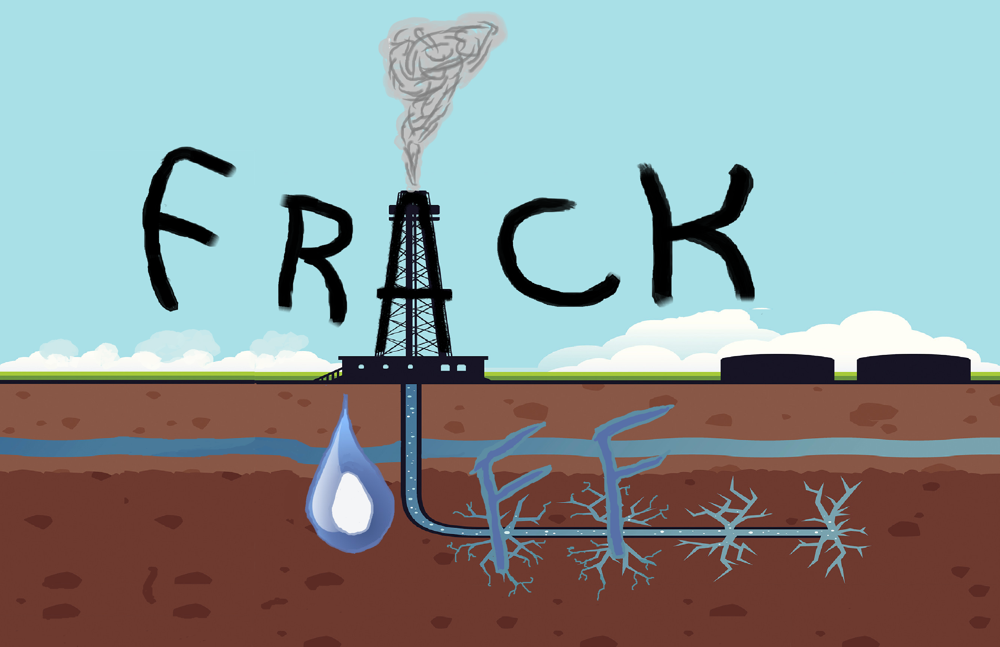
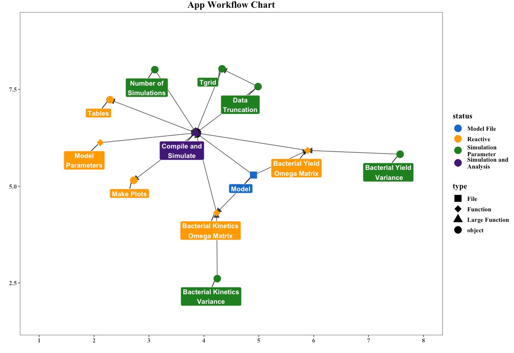

## **Quick Summary** 

Navitage to the `Plots` or `Tables` tab on the left, and then adjust `Model Parameters` to see their effect on the overall process. Note that not every parameter will have an effect on every plot.

## **Purpose** 

This app is associated with my senior design project in chemical engineering at Drexel University (Team Name: Frack Off)[^1].
The model was developed to simulate the degradation of heavy organic compounds through anaerobic digestion. Five unique processes take place in the simulated batch reactor, including the enzymatic hydrolysis of guar gum, acidogenesis of polysaccharide chains, acetogensis, methanogenesis, and anaerobic degredation using bacteroides. See the `Background of Process` tab for a more detailed process description.
  

<!--  -->

Credit: Luke Growney
# **Introduction and Motivation**

In the pursuit of energy independence in the United States and abroad, hydraulic fracking is an increasingly popular method of natural gas extraction. As the popularity of this particular form of drilling increases, some of the negative impacts of the process are starting to manifest as well. The primary impact that most people hear about is the contamination of drinking water supplies on or near fracking sites. The goal of this project was to develop a system that is able to remove the contaminants left in the water affected by the fracking process. A batch anearobic bioreactor is the second out of four units in the developed PFD, and was modeled using kinetic parameters found in the literature. A snippet of the PFD can be seen below. The model simulates the degredation and conversion of particular contaminants into biogas (*$CO_{2}$*, *$H_{2}$*, and *$CH_{4}$*). 
  
The Contaminants being degraded in this unit include:

  * **Guar Gum** *(Done)*
  * **PEG-400** *(Done)*
  * **Petrolium Distillates** *(Accounted For)*
  * **Methanol** *(Done)*
  * **Isopropanol** *(Done)*

 

## **PFD Snippet (Batch Anaerobic Bioreactor)**

  

# **What the App Does**

The purpose of this app is to optimize the model parameters in order to increase the profitability of the bioreactor. The user will be able to adjust initial bacteria concentrations, reactor temperature (both static and dynamic), etc., and see a visual representation of the outcome. Note that not all adjustable parameters will have an effect on every plot.

As soon as the user loads the app, the model is compiled and run using the current parameter settings. As the user adjusts these parameters, the plots and tables will update according to the new settings.

The tabs on the left then allow the user to navigate the simulated reactor output and read more about the process. You can also specify the time in which to truncate the data and evaluate the output, though the minimum value is currently 100 h. The reactor that follows the anaerobic digestor is capable of removing small quantities left over. Ideally you would set a minimum acceptable concentration, and optimize parameters to decrease the time required to reduce the contaminants to that concentration, though this not been implemented due to the lack of observational data.

## **App Reactivity**

Below is a rough illustration of how the app works evaluates reactive objects as parameters are altered. To see all the reactive objects, press `Cmd + F3` on mac and `Ctrl + F3` on windows (Note that this will slow down the app, and will become more noticable with a larger number of simulations).

# **Side Tabs**

  * Use the `Model Parameters` tab to adjust the model inputs. Clicking a category will open a separate menu with adjustable parameters. Click the category again to make the menu disappear. The `simulation` option will allow for a sensitivity analysis of a chosen parameter.

  * Use the `Plots` tab to view a specific set of plots. Selections include *Main Components*,  *Intermediate Products*,  *Bacteria Growth*, and *Reactor Properties*.

  * Use the `Tables` tab to view the input and output concentrations. Selections include *Main Components*  and *Reactor Properties*.
 
  * Use the `Codes` tab to display and download the model file, <tt>AnaerobicDigestionShiny.cpp</tt>, or the <tt>app.R</tt> used for this application. Note that other scripts are needed to run the model.

  * Use the `Mathematical Model` tab  to display the differential equations present in the model.
  
  * Use the `Background of Process` tab to download a PDF summarizing the model process.

  
 
[^1]: Credit:

    Year: 2019, Team Name: "Frack Off", Model/App Developer: Kyle Barrett
    Group Members: Luke Growney, Prem Patel, Farhaan Rizvi

